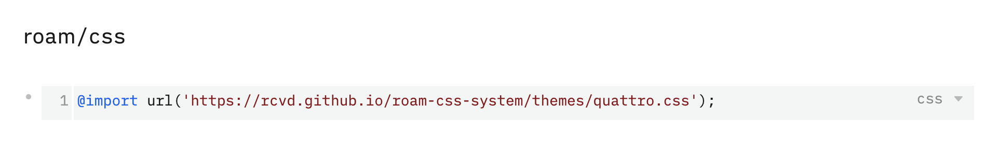
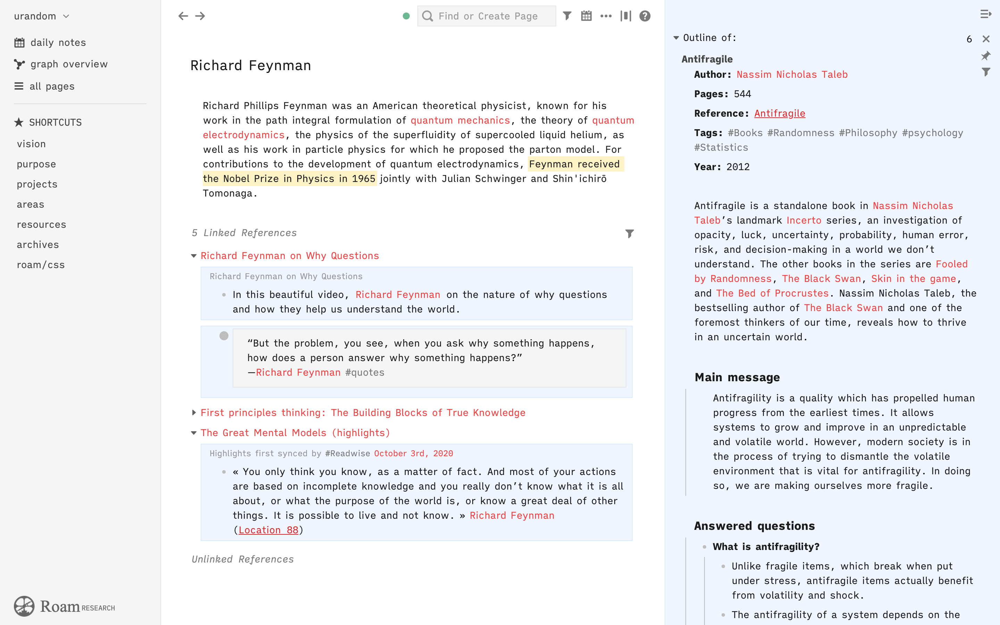
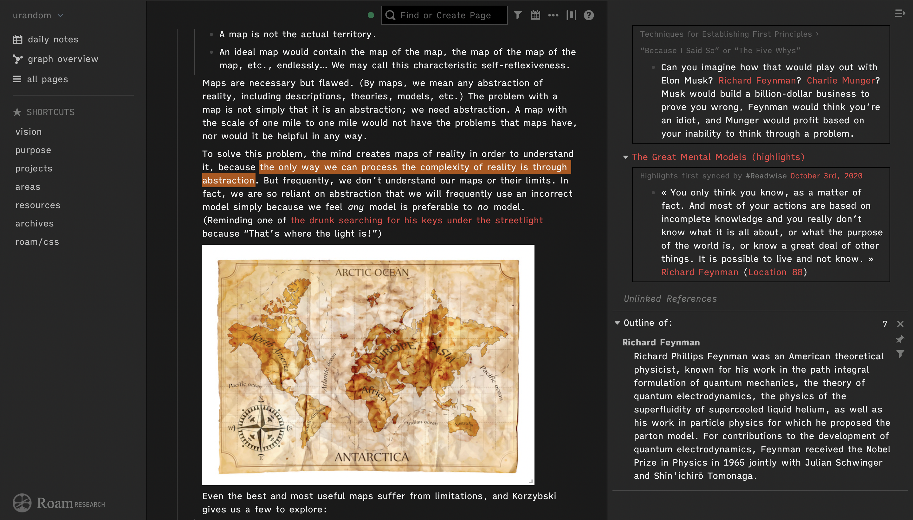

# roam-css-system
Roam CSS System

## What is it?
The Roam CSS System is a powerful framework for customizing the look and feel of [Roam Research](https://roamresearch.com).

## How does this work?
- Create or modify your 'roam/css' page.
- Add a new code block and set the language to 'CSS'.
- Add the following line to it:
```@import url('https://rcvd.github.io/roam-css-system/themes/quattro.css');```

- If you want to force the bright or darj mode independent of the system settings use:
 
```@import url('https://rcvd.github.io/roam-css-system/themes/quattro_dark.css');```
or

```@import url('https://rcvd.github.io/roam-css-system/themes/quattro_light.css');```

## Themes
### iA Quattro




## Bugs and feedback
- If you find a bug, file it under Issues with a short description and an screenshot
- If you want to discuss an issue contact me on [Twitter](https://twitter.com/rcvd_io) or drop me an email to roam (at) rcvd (dot) io

## If you want to support my work
- [Flattr](https://flattr.com/@rcvd)
- [Paypal](https://paypal.me/rcvd?locale.x=de_DE)
