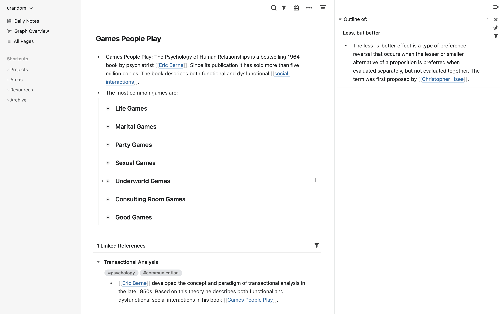
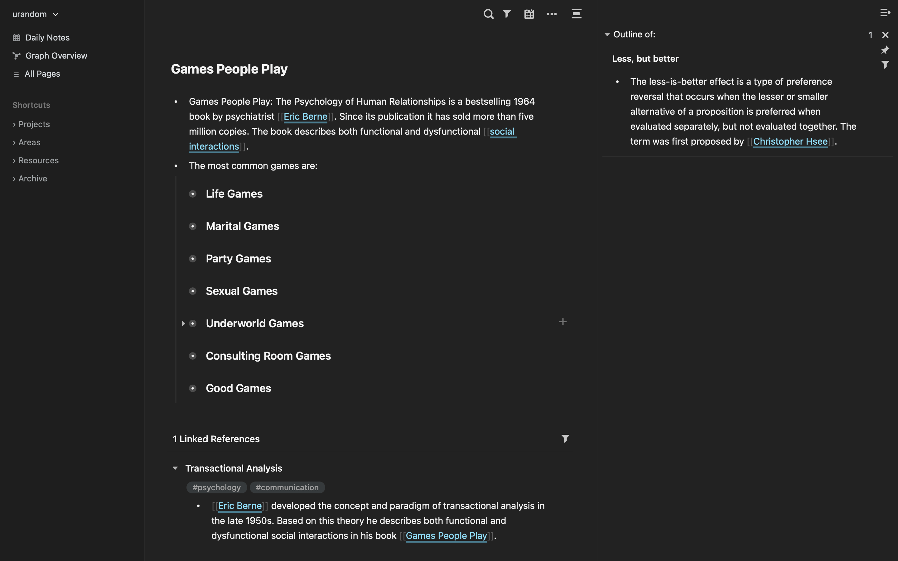
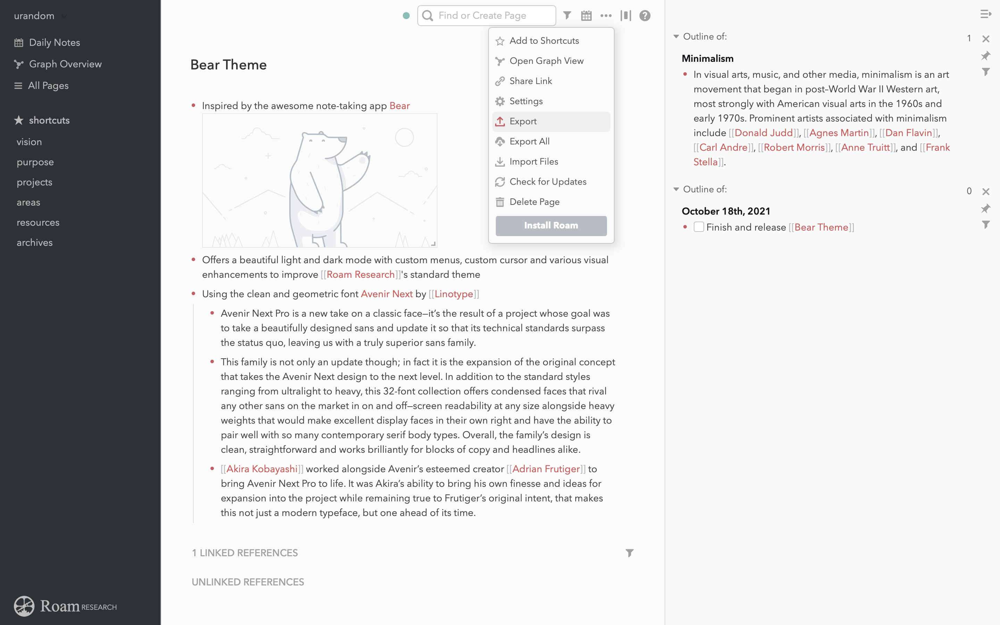
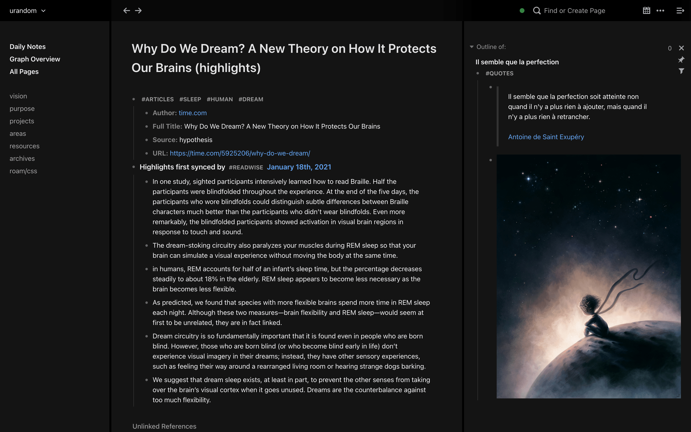
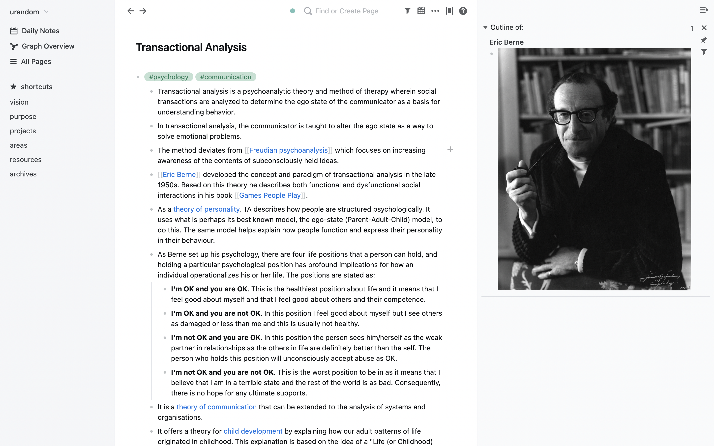
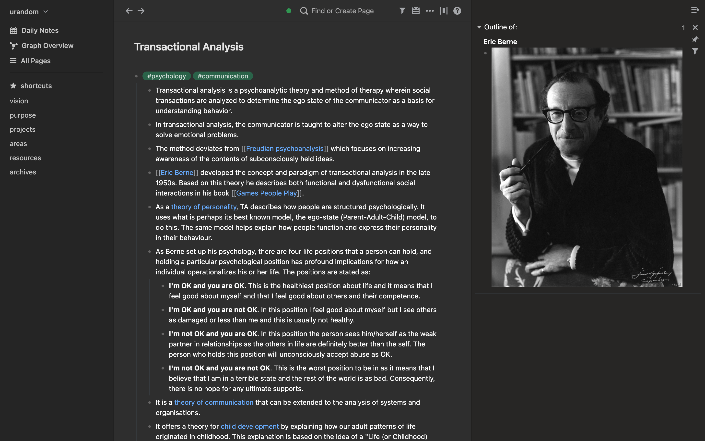
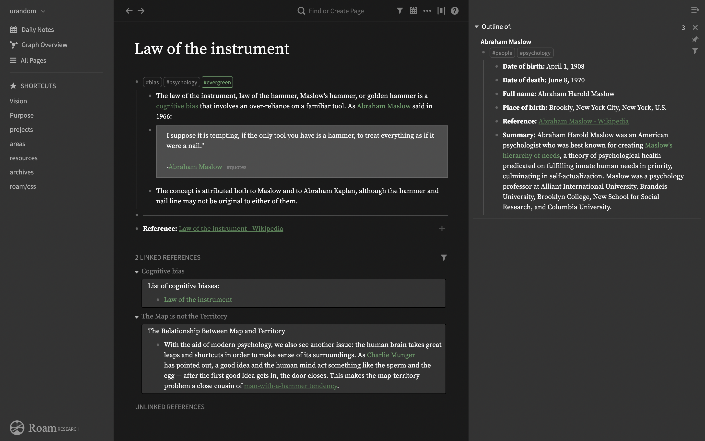

# The Roam CSS System

## What is it?
The Roam CSS System is a modular, block-based approach for changing the look and feel of [Roam Research](https://roamresearch.com). It has been thoughtfully engineered to allow easy customization by the non-tech-affine end user and offers different minimal, beautiful designed elegant themes.

## If you want to support my work
<a href="https://www.buymeacoffee.com/rcvdio" target="_blank"></a>
- [Buy Me a Coffee](https://www.buymeacoffee.com/rcvdio)
- [Become a supporter on gödel.io](https://www.goedel.io/subscribe?utm_medium=web&utm_source=subscribe-widget&utm_content=47299057)
- [Flattr](https://flattr.com/@rcvd)
- [Paypal](https://paypal.me/rcvd)

Thanks a lot for your support!

## How does this work?
- Create or modify your 'roam/css' page.
- Add a new code block **at the top** and set the language to 'CSS'.
- For the iA Quattro theme, add the following line to it:

```@import url('https://rcvd.github.io/roam-css-system/themes/quattro.css');```
- If you want the lesswrong theme, add the following line to it:

```@import url('https://rcvd.github.io/roam-css-system/themes/lesswrong.css');```


## Force light or dark mode
- If you want to force the bright or dark mode independent of the system settings use:

  ```@import url('https://rcvd.github.io/roam-css-system/themes/quattro_dark.css');```   
  
  ```@import url('https://rcvd.github.io/roam-css-system/themes/lesswrong_dark.css');```
  
  or 
  
  ```@import url('https://rcvd.github.io/roam-css-system/themes/quattro_light.css');```
  
  ```@import url('https://rcvd.github.io/roam-css-system/themes/lesswrong_light.css');```
  
## Customize the themes
You can easily customize 400 UI elements with more than 1,700 attributes. Read the detailed instructions for customizing it [here](https://bit.ly/roam-css-sys).

## Themes
### Craft





### Bear



### Apple




### Things




### iA Quattro


### Lesswrong





## Bugs and feedback
- If you find a bug, file it under Issues with a short description and an screenshot
- If you want to discuss an issue contact me on [Twitter](https://twitter.com/rcvd_io) or drop me an email to roam (at) rcvd (dot) io
